# 🏪 Anchor NFT Marketplace

A decentralized NFT marketplace built on Solana using the Anchor framework. This marketplace allows users to list, buy, and delist NFTs with built-in fee collection and secure escrow functionality.

## 📋 Table of Contents

- [🎯 Overview](#-overview)
- [🏗️ Architecture](#️-architecture)
- [🔄 Transaction Flow](#-transaction-flow)
- [🚀 Quick Start](#-quick-start)
- [📖 Usage Examples](#-usage-examples)
- [🔧 API Reference](#-api-reference)
- [🌟 Real-Life Examples](#-real-life-examples)
- [🛠️ Development](#️-development)
- [🔒 Security](#-security)
- [📄 License](#-license)

## 🎯 Overview

The Anchor NFT Marketplace is a secure, decentralized platform where users can:

- **List NFTs** for sale with custom pricing
- **Purchase NFTs** with automatic payment distribution
- **Delist NFTs** to cancel listings and retrieve their assets
- **Collect marketplace fees** for platform sustainability

### Key Features

✅ **Secure Escrow**: NFTs are held in program-controlled vaults during listing  
✅ **Automatic Fee Distribution**: Marketplace fees are automatically deducted  
✅ **Atomic Transactions**: All operations are atomic - they either fully succeed or fail  
✅ **PDA-based Security**: Uses Program Derived Addresses for maximum security  
✅ **Gas Efficient**: Optimized for minimal transaction costs  

## 🏗️ Architecture

### Account Structure

```
Marketplace Program
├── Marketplace Account (Global Config)
│   ├── Name: "SuperNFT Market"
│   ├── Fee: 250 basis points (2.5%)
│   ├── Authority: Admin public key
│   └── Bump: PDA bump seed
│
├── Listing Account (Per NFT)
│   ├── Maker: Seller's public key
│   ├── Maker Mint: NFT mint address
│   ├── Price: Sale price in lamports
│   └── Bump: PDA bump seed
│
└── Vault Account (Token Account)
    ├── Mint: NFT mint address
    ├── Authority: Listing PDA
    └── Amount: 1 (NFT quantity)
```

### Program Derived Addresses (PDAs)

```rust
// Marketplace PDA
seeds = [b"marketplace", marketplace_name.as_bytes()]

// Listing PDA  
seeds = [marketplace.key(), nft_mint.key()]

// Vault ATA
associated_token::mint = nft_mint
associated_token::authority = listing_pda
```

## 🔄 Transaction Flow

### 1. Initialize Marketplace

```mermaid
graph TD
    A[Admin] -->|Calls init_marketplace| B[Create Marketplace Account]
    B --> C[Set marketplace name & fee]
    C --> D[Store admin authority]
    D --> E[✅ Marketplace Ready]
    
    style A fill:#e1f5fe
    style E fill:#c8e6c9
```



### 2. List NFT Flow

```mermaid
sequenceDiagram
    participant Seller
    participant Program
    participant Vault
    participant Listing
    
    Seller->>Program: Call list(price)
    Program->>Listing: Create listing account
    Program->>Vault: Create token vault
    Program->>Vault: Transfer NFT to vault
    Vault-->>Seller: NFT now in escrow
    Program-->>Seller: ✅ Listing created
```



### 3. Purchase NFT Flow

```mermaid
sequenceDiagram
    participant Buyer
    participant Program
    participant Seller
    participant Treasury
    participant Vault
    
    Buyer->>Program: Call purchase()
    Program->>Seller: Transfer payment (97.5%)
    Program->>Treasury: Transfer fee (2.5%)
    Program->>Buyer: Transfer NFT from vault
    Program->>Program: Close vault account
    Program->>Seller: Refund vault rent
    Program-->>Buyer: ✅ NFT purchased
```



### 4. Delist NFT Flow


## 🚀 Quick Start

### Prerequisites

- [Rust](https://rustup.rs/) 1.70+
- [Solana CLI](https://docs.solana.com/cli/install-solana-cli-tools) 1.16+
- [Anchor](https://www.anchor-lang.com/docs/installation) 0.31+
- [Node.js](https://nodejs.org/) 16+

### Installation

```bash
# Clone the repository
git clone https://github.com/your-username/anchor-marketplace.git
cd anchor-marketplace

# Install dependencies
npm install

# Build the program
anchor build

# Run tests
anchor test
```

### Deployment

```bash
# Deploy to localnet
anchor deploy

# Deploy to devnet
anchor deploy --provider.cluster devnet
```

## 📖 Usage Examples

### Initialize a New Marketplace

```typescript
import * as anchor from "@coral-xyz/anchor";
import { Program } from "@coral-xyz/anchor";
import { Marketplace } from "../target/types/marketplace";

const program = anchor.workspace.Marketplace as Program<Marketplace>;

// Initialize marketplace
await program.methods
  .initMarketplace("SuperNFT Market", 250) // 2.5% fee
  .accounts({
    admin: admin.publicKey,
    marketplace: marketplacePda,
    systemProgram: anchor.web3.SystemProgram.programId,
  })
  .signers([admin])
  .rpc();
```

### List an NFT

```typescript
// List NFT for 5 SOL
const priceInLamports = 5 * anchor.web3.LAMPORTS_PER_SOL;

await program.methods
  .listing(new anchor.BN(priceInLamports))
  .accounts({
    seller: seller.publicKey,
    sellerMint: nftMint,
    sellerAta: sellerTokenAccount,
    listing: listingPda,
    vault: vaultTokenAccount,
    marketplace: marketplacePda,
    tokenProgram: TOKEN_PROGRAM_ID,
    associatedTokenProgram: ASSOCIATED_TOKEN_PROGRAM_ID,
    systemProgram: anchor.web3.SystemProgram.programId,
  })
  .signers([seller])
  .rpc();
```

### Purchase an NFT

```typescript
await program.methods
  .purchase()
  .accounts({
    buyer: buyer.publicKey,
    seller: seller.publicKey,
    sellerMint: nftMint,
    buyerAta: buyerTokenAccount,
    vault: vaultTokenAccount,
    listing: listingPda,
    marketplace: marketplacePda,
    tokenProgram: TOKEN_PROGRAM_ID,
    associatedTokenProgram: ASSOCIATED_TOKEN_PROGRAM_ID,
    systemProgram: anchor.web3.SystemProgram.programId,
  })
  .signers([buyer])
  .rpc();
```

## 🔧 API Reference

### Instructions

| Instruction | Description | Parameters |
|-------------|-------------|------------|
| `init_marketplace` | Initialize a new marketplace | `name: String, fee: u16` |
| `listing` | List an NFT for sale | `price: u64` |
| `delisting` | Remove NFT from marketplace | None |
| `purchase` | Buy a listed NFT | None |

### Accounts

#### Marketplace Account
```rust
pub struct Marketplace {
    pub admin: Pubkey,        // Marketplace admin
    pub name: String,         // Marketplace name
    pub fee: u16,             // Fee in basis points
    pub bump: u8,             // PDA bump
}
```

#### Listing Account
```rust
pub struct Listing {
    pub maker: Pubkey,        // NFT seller
    pub maker_mint: Pubkey,   // NFT mint address
    pub price: u64,           // Price in lamports
    pub bump: u8,             // PDA bump
}
```

## 🌟 Real-Life Examples

### Example 1: Digital Art Marketplace

**Scenario**: Alice wants to sell her digital artwork as an NFT


**Transaction Details**:
- Alice lists her NFT for 10 SOL
- Bob purchases it
- Alice receives: 9.75 SOL (97.5%)
- Marketplace receives: 0.25 SOL (2.5%)
- Bob gets the NFT ownership

### Example 2: Gaming Items Marketplace

**Scenario**: A game developer creates a marketplace for in-game items


**Flow**:
1. **Game Integration**: Game mints NFTs for rare weapons/items
2. **Player Trading**: Players list items they don't need
3. **Discovery**: Other players browse and purchase items
4. **Automatic Distribution**: Payments split automatically

### Example 3: Music NFT Platform

**Scenario**: Musicians selling exclusive tracks and concert tickets

| Action | Seller Receives | Marketplace Fee | Buyer Gets |
|--------|----------------|-----------------|------------|
| List Album NFT (5 SOL) | 0 SOL | 0 SOL | NFT in escrow |
| Buyer Purchases | 4.875 SOL | 0.125 SOL | Album NFT |
| Cancel Listing | NFT returned | 0 SOL | - |

## 🛠️ Development

### Project Structure

```
anchor-marketplace/
├── programs/
│   └── marketplace/
│       ├── src/
│       │   ├── lib.rs              # Main program entry
│       │   ├── constants.rs        # Program constants
│       │   ├── error.rs            # Custom errors
│       │   ├── instructions/       # Instruction handlers
│       │   │   ├── initialize.rs   # Marketplace setup
│       │   │   ├── list.rs         # NFT listing
│       │   │   ├── purchase.rs     # NFT purchasing
│       │   │   └── delist.rs       # NFT delisting
│       │   └── state/              # Account structures
│       │       ├── marketplace.rs  # Marketplace account
│       │       └── listing.rs      # Listing account
│       └── Cargo.toml
├── tests/
│   └── marketplace.ts              # Integration tests
├── app/                            # Frontend application
├── Anchor.toml                     # Anchor configuration
└── package.json                    # Node.js dependencies
```

### Testing

```bash
# Run all tests
anchor test

# Run specific test
anchor test --grep "should initialize marketplace"

# Test with verbose output
anchor test --verbose
```

### Error Handling

The program includes comprehensive error handling:

```rust
#[error_code]
pub enum MarketplaceError {
    #[msg("Marketplace name too long")]
    NameTooLong,
    
    #[msg("Invalid marketplace fee")]
    InvalidFee,
    
    #[msg("Insufficient funds for purchase")]
    InsufficientFunds,
    
    #[msg("NFT not listed for sale")]
    NotListed,
}
```

## 🔒 Security

### Security Features

1. **PDA-based Access Control**: All critical accounts use PDAs
2. **Ownership Verification**: Strict checks on NFT ownership
3. **Atomic Transactions**: All-or-nothing transaction semantics
4. **Rent Exemption**: All accounts are rent-exempt
5. **Integer Overflow Protection**: Safe math operations

### Security Considerations

- ⚠️ **Always verify account ownership** before operations
- ⚠️ **Check marketplace authority** for admin operations
- ⚠️ **Validate price bounds** to prevent economic exploits
- ⚠️ **Audit token program interactions** regularly

### Audit Checklist

- [ ] Account validation logic
- [ ] Arithmetic operations safety
- [ ] PDA derivation correctness
- [ ] Token transfer security
- [ ] Access control mechanisms

## 🚦 Status

- ✅ Core marketplace functionality
- ✅ NFT listing and delisting
- ✅ Secure purchase mechanism
- ✅ Fee collection system
- ✅ Comprehensive testing
- 🔄 Frontend integration (in progress)
- 🔄 Advanced filtering (planned)
- 🔄 Batch operations (planned)

## 🤝 Contributing

1. Fork the repository
2. Create a feature branch (`git checkout -b feature/amazing-feature`)
3. Commit your changes (`git commit -m 'Add amazing feature'`)
4. Push to the branch (`git push origin feature/amazing-feature`)
5. Open a Pull Request

## 📄 License

This project is licensed under the MIT License - see the [LICENSE](LICENSE) file for details.

---
**Built with ❤️ using [Anchor](https://anchor-lang.com) and [Solana](https://solana.com)**
